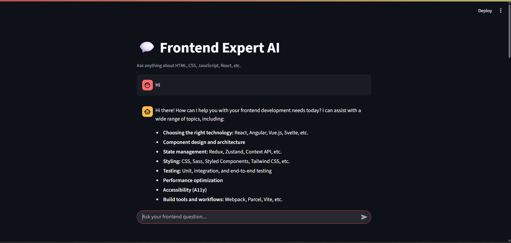

# 💬 Frontend Expert AI Agent

A chat-style AI assistant powered by Google's Gemini model, designed to answer all your frontend development questions – from HTML & CSS to React & Tailwind!

Built using **Python**, **Streamlit**, and the **Gemini API**, this project simulates a natural conversation with a frontend expert.

---

## 🚀 Features

- 🧠 AI-powered answers to frontend questions  
- 💬 Chat-style interface with conversation history  
- ⌨️ Typing animation for a realistic feel  
- ⚡ Fast response times with caching  
- 🌐 Gemini API integration (via `agents` library)

---

## 📸 Demo


---

## 🛠️ Tech Stack

| Technology | Purpose |
|------------|---------|
| 🐍 Python | Core logic |
| 🌐 Streamlit | Frontend UI |
| 🧠 Gemini API | AI agent responses |
| 🧰 agents | Agent orchestration |
| 🧪 dotenv | Secure environment variables |

---

## 📦 Installation

```bash
# 1. Clone the repo
git clone https://github.com/Waliii31/Fronend_Expert_Agent.git
cd Fronend_Expert_Agent

# 2. Create a virtual environment
python -m venv .venv
source .venv/bin/activate  # or .venv\Scripts\activate on Windows

# 3. Install dependencies
pip install -r requirements.txt
```


## 🔐 Setup .env
Get your Gemini API key from [Google AI Studio](https://aistudio.google.com/apikey)

Create a .env file in the root directory:

 ```bash
GEMINI_API_KEY=your_gemini_api_key_here
```

## Project Structure
```bash
📁 Ai agents/
├── .env                    # Environment variables
├── main.py                 # Agent config and logic
├── streamlit_app.py        # Chat frontend UI
├── pyproject.toml          # Project metadata
└── uv.lock                 # Package lock file
```

## 🤝 Contributing
Pull requests are welcome! If you want to:

- Add new agent roles
- Optimize Gemini integration
- Improve UI design

Just fork the repo and open a PR!

## 👨‍💻 Author
Made with 💻 by [Wali Zafri](https://wali-portfolio-website.vercel.app/)
Part of my AI projects series 🤖
